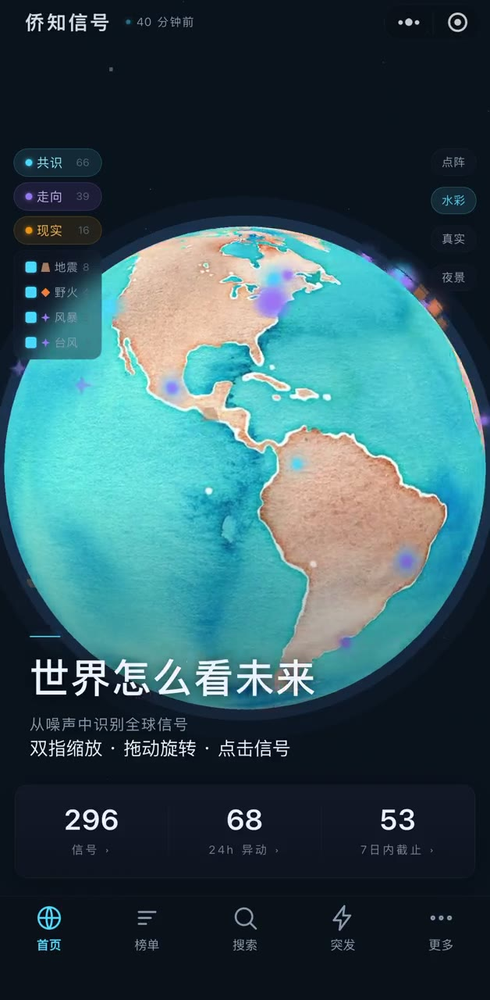
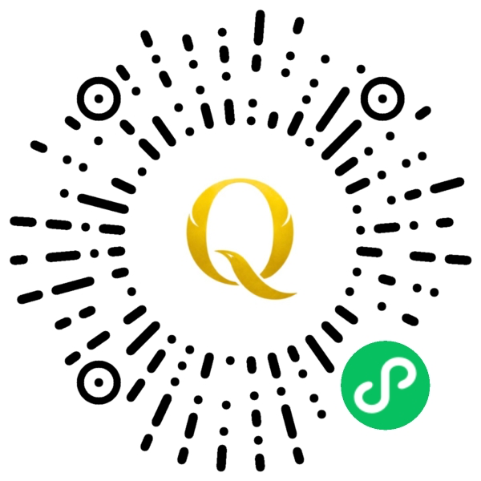

# 侨知信号 · Qiaozhi Signal

全球公开数据信号终端。微信小程序,已上线。

> 项目展示页。源码为私有仓库。

---

## 演示

▶︎ [点击播放完整演示](assets/demo.mp4) (2 分钟)

**体验**:微信扫码进入小程序

---

## 产品

**世界怎么看未来 · 从噪声中识别全球信号**

聚合全球公开事件数据与现实世界风险,经采集 → 中文化 → 分类 → 筛选 → 可视化,呈现为可检索的信号库。面向出海、跨境与关注全球宏观趋势的读者。

- **信号地球仪** — 3D 地球呈现全球信号分布,三类信号独立图层,可按灾害类型细分勾选
- **三类信号** — 共识信号(市场共识预期)· 全球走向(各国治理走向)· 现实信号(地震/野火/洪水等现实风险)
- **24h 异动榜** — 近一日预期变动最大的信号排序
- **搜索数据库** — 按类目、关键词、截止时间检索
- **每 4 小时同步** — 数据由境外构建流水线定时更新

---

## 工程要点

- **多源采集与筛选** — 全量池 2000+ 条/次,经多道闸门过滤噪声、博彩化形态与不适宜内容,保留约 300 条高价值信号
- **信号定义** — 以「意外的、可观测的、非人格化的世界状态变化」为准绳,建立时效半衰期、材料性门槛、零信息量过滤等规则
- **中文化管线** — AI 批量翻译 + 源文本哈希缓存,仅翻新增与变更
- **3D 渲染** — Three.js 地球,形状与颜色双编码区分信号类型,屏幕空间拾取解决密集点位可点击性
- **内容合规闸门** — 构建期静态扫描,不合格产物拒绝发布(fail-closed)

---

## 技术栈

微信小程序原生 · Three.js · 腾讯云开发(云函数 + 云数据库)· Node.js · GitHub Actions

---

## 我的角色

独立完成从 0 到 1 的产品建设:

产品定义 · 信号筛选标准制定 · 信息架构 · UI 设计系统 · 3D 可视化 · 前端开发 · 数据管线 · AI 集成 · 内容合规策略 · 上线

---

## 声明

本产品为只读信息展示工具,不提供任何交易功能。所有内容来自公开数据,仅供参考,不构成投资建议。

---

## 联系

diruiarete@gmail.com
